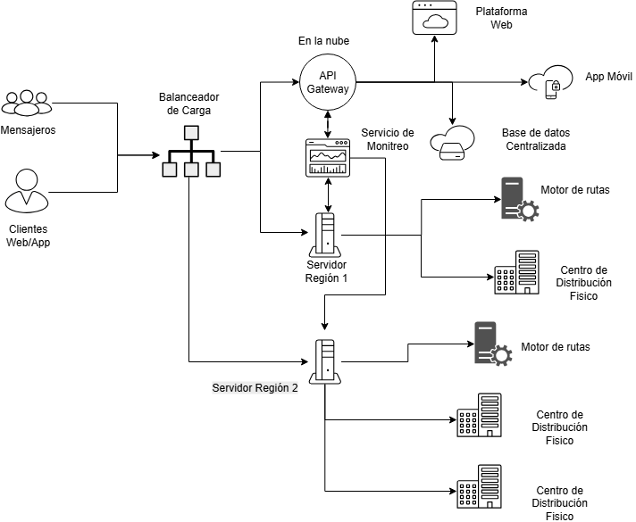

# 🗒️ Registro de Trabajo en Clase - Taller 4

## 📆 Fecha de la sesión
_6 de Septiembre del 2025._

## 👥 Integrantes presentes
- Samuel Esptia Cruz
- Edwin ALejandro Gutierrez Rodriguez
- Nicolas Stiven Ortiz Cortes

## 🧠 Actividades realizadas en clase

Durante la sesión:

- **¿Qué se discutió con el equipo?** Se revisó el contexto de RedExpress y se identificaron los componentes clave de la infraestructura híbrida (usuarios, nube, servidores regionales, centros de distribución y monitoreo). También discutimos los principales riesgos, como los puntos únicos de falla y la necesidad de garantizar alta disponibilidad en temporadas de alto volumen (Navidad).
- ¿Qué decisiones de modelado se tomaron?** Se decidió modelar la infraestructura a partir de los flujos críticos, mostrando cómo los usuarios se conectan al balanceador de carga y desde allí a dos ramas principales: el API Gateway en la nube, enlazado con la app, la plataforma y la base de datos centralizada, y los servidores regionales, conectados al motor de búsqueda/rutas y a los centros de distribución físicos. También se incorporó el servicio de monitoreo, ligado únicamente al API Gateway y a los servidores regionales, lo que permitió evidenciar la limitación actual de cobertura en el seguimiento de la infraestructura.
- **¿Qué herramientas se usaron (papel, pizarra, draw.io, Astah)?** Se utilizó draw.io para diagramar el mapa preliminar de infraestructura.
- **¿Qué parte del trabajo se alcanzó a desarrollar?** Se logró construir el mapa preliminar de infraestructura (AS-IS) de RedExpress y documentar los flujos críticos de información. También se identificaron zonas sensibles como la base de datos centralizada (punto único de falla), la latencia en el rastreo en tiempo real y las limitaciones del monitoreo básico.

## 🧩 Boceto inicial del modelo

## 🔁 Tareas definidas para complementar el taller

| Tarea asignada | Responsable | Fecha estimada |
|----------------|-------------|----------------|
| Modelado final en draw.io | Nicolas Ortiz | 08/08 |
| Redacción del informe     | Samuel Espitia | 10/08 |
| Identificación de riesgos y propuesta de mitigación | Edwin Gutierrez | 12/08 |

---

_Este documento resume el trabajo colaborativo realizado durante la sesión del taller 4 en el curso AREM - Universidad de La Sabana._
